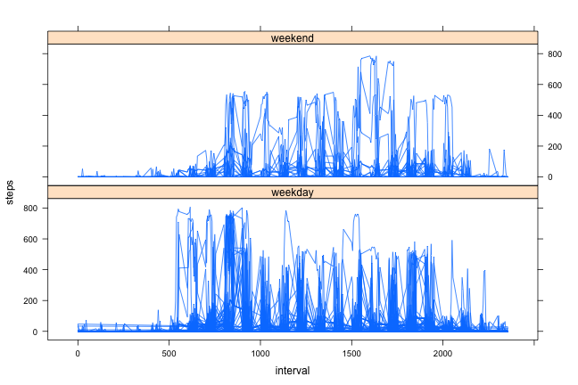

Reproducible Research Peer Assessment 1
========================================================

## Introduction


The following is a demonstration of some simple analyses than can be conducted on an person's personal fitness data.  Using the raw data for number of steps taken each day over two months by a single anonymous individual, we can answer questions such as:

* How many steps does this person take in an average day?
* What does an average day look like for this person, in terms of steps taken?  Which times of day are the most and least active?
* Are there differences in activity patterns between weekdays and weekends?

The data can be downloaded at [Activity Monitoring Data](https://d396qusza40orc.cloudfront.net/repdata%2Fdata%2Factivity.zip)

## Loading and preprocessing the data

Before any analysis can be done on the fitness data, a few steps must be taken to load the data and transform it into a suitable format.

Loading the data - in order to complete this step, the [Activity Monitoring Data](https://d396qusza40orc.cloudfront.net/repdata%2Fdata%2Factivity.zip) csv must already be in the working directory.

```r
stepsdata <- read.csv("./activity.csv", header=TRUE)
head(stepsdata)
```

```
##   steps    date interval
## 1    NA 10/1/12        0
## 2    NA 10/1/12        5
## 3    NA 10/1/12       10
## 4    NA 10/1/12       15
## 5    NA 10/1/12       20
## 6    NA 10/1/12       25
```

The "Date" column into a variable of the type "date" for ease in charting weekends against weekdays.

```r
stepsdata$date <- as.Date(as.character(stepsdata$date), format="%m/%d/%y")
```

## What is the mean total number of steps taken per day?

Steps per day were totalled and saved as a separate data frame.  A histogram of this data shows that the individual took between 10000 and 15000 steps on most days.


```r
steps_by_day <- with(stepsdata, split(steps, date))
steps_per_day <- sapply(steps_by_day, sum)
steps_per_day
```

```
## 2012-10-01 2012-10-02 2012-10-03 2012-10-04 2012-10-05 2012-10-06 
##         NA        126      11352      12116      13294      15420 
## 2012-10-07 2012-10-08 2012-10-09 2012-10-10 2012-10-11 2012-10-12 
##      11015         NA      12811       9900      10304      17382 
## 2012-10-13 2012-10-14 2012-10-15 2012-10-16 2012-10-17 2012-10-18 
##      12426      15098      10139      15084      13452      10056 
## 2012-10-19 2012-10-20 2012-10-21 2012-10-22 2012-10-23 2012-10-24 
##      11829      10395       8821      13460       8918       8355 
## 2012-10-25 2012-10-26 2012-10-27 2012-10-28 2012-10-29 2012-10-30 
##       2492       6778      10119      11458       5018       9819 
## 2012-10-31 2012-11-01 2012-11-02 2012-11-03 2012-11-04 2012-11-05 
##      15414         NA      10600      10571         NA      10439 
## 2012-11-06 2012-11-07 2012-11-08 2012-11-09 2012-11-10 2012-11-11 
##       8334      12883       3219         NA         NA      12608 
## 2012-11-12 2012-11-13 2012-11-14 2012-11-15 2012-11-16 2012-11-17 
##      10765       7336         NA         41       5441      14339 
## 2012-11-18 2012-11-19 2012-11-20 2012-11-21 2012-11-22 2012-11-23 
##      15110       8841       4472      12787      20427      21194 
## 2012-11-24 2012-11-25 2012-11-26 2012-11-27 2012-11-28 2012-11-29 
##      14478      11834      11162      13646      10183       7047 
## 2012-11-30 
##         NA
```


```r
hist(steps_per_day, main="Histogram of Steps Per Day", xlab="Steps Per Day")
```

 

Mean and median can be calculated from this data frame, and, as expected, they both fall within the 10000-15000 range.


```r
mean(steps_per_day, na.rm=TRUE)
```

```
## [1] 10766
```

```r
median(steps_per_day, na.rm=TRUE)
```

```
## [1] 10765
```

## What is the average daily activity pattern?

A separate data frame was created with the 5 minute intervals in one column and the mean number of steps for that interval across all days in another.  NA values were ignored.


```r
library(plyr)
```

```
## 
## Attaching package: 'plyr'
## 
## The following object is masked _by_ '.GlobalEnv':
## 
##     ozone
```

```r
stepsdatanotNA <- stepsdata[!is.na(stepsdata$steps),]
intervalmeans <- ddply(stepsdatanotNA,.(interval), summarize, mean=mean(steps))
head(intervalmeans)
```

```
##   interval    mean
## 1        0 1.71698
## 2        5 0.33962
## 3       10 0.13208
## 4       15 0.15094
## 5       20 0.07547
## 6       25 2.09434
```

A time series plot shows the times of most and least activity.

```r
plot(intervalmeans$interval, intervalmeans$mean, type="l", main="Average Daily Activity Pattern", xlab="Interval", ylab="Mean number of steps")
```

 

The time of most activity appears to be between 5:00 and 10:00 AM.  Using the max() function, we can see that it is 8:35 AM.

```r
intervalmeans[which.max(intervalmeans$mean),]
```

```
##     interval  mean
## 104      835 206.2
```

## Imputing missing values

As shown earlier, several values in the "steps" column are missing.  To calculate the number of missing values, the following code was used:

```r
sum(is.na(stepsdata$steps))
```

```
## [1] 2304
```

These missing values could make the full data set difficult to analyze.  So, I decided to replace each missing value with the average value for that 5-minute interval.  The days with missing data will be made to look like the average day shown in the previous time series plot.

```r
for (obs in 1:nrow(stepsdata)) {
  if (is.na(stepsdata[obs,1])){
    if (obs%%288 == 0){
      stepsdata[obs,1] <-intervalmeans$mean[288]
    }
    else {
      stepsdata[obs,1] <- intervalmeans$mean[obs%%288]
    }
  }
}
```

This data should not change the overall pattern of days much, except to move the median closer to the mean as more days are more days are being created with the mean number of steps.  The histogram should also reflect this with more days in the center column of the graph.


```r
steps_by_day <- with(stepsdata, split(steps, date))
steps_per_day <- sapply(steps_by_day, sum)
steps_per_day
```

```
## 2012-10-01 2012-10-02 2012-10-03 2012-10-04 2012-10-05 2012-10-06 
##      10766        126      11352      12116      13294      15420 
## 2012-10-07 2012-10-08 2012-10-09 2012-10-10 2012-10-11 2012-10-12 
##      11015      10766      12811       9900      10304      17382 
## 2012-10-13 2012-10-14 2012-10-15 2012-10-16 2012-10-17 2012-10-18 
##      12426      15098      10139      15084      13452      10056 
## 2012-10-19 2012-10-20 2012-10-21 2012-10-22 2012-10-23 2012-10-24 
##      11829      10395       8821      13460       8918       8355 
## 2012-10-25 2012-10-26 2012-10-27 2012-10-28 2012-10-29 2012-10-30 
##       2492       6778      10119      11458       5018       9819 
## 2012-10-31 2012-11-01 2012-11-02 2012-11-03 2012-11-04 2012-11-05 
##      15414      10766      10600      10571      10766      10439 
## 2012-11-06 2012-11-07 2012-11-08 2012-11-09 2012-11-10 2012-11-11 
##       8334      12883       3219      10766      10766      12608 
## 2012-11-12 2012-11-13 2012-11-14 2012-11-15 2012-11-16 2012-11-17 
##      10765       7336      10766         41       5441      14339 
## 2012-11-18 2012-11-19 2012-11-20 2012-11-21 2012-11-22 2012-11-23 
##      15110       8841       4472      12787      20427      21194 
## 2012-11-24 2012-11-25 2012-11-26 2012-11-27 2012-11-28 2012-11-29 
##      14478      11834      11162      13646      10183       7047 
## 2012-11-30 
##      10766
```


```r
hist(steps_per_day, main="Histogram of Steps Per Day", xlab="Steps Per Day")
```

 


```r
mean(steps_per_day, na.rm=TRUE)
```

```
## [1] 10766
```

```r
median(steps_per_day, na.rm=TRUE)
```

```
## [1] 10766
```

Replacing NA values in this way moves the median up one to 10766, which is also the mean value.

## Are there differences in activity patterns between weekdays and weekends?

In order to answer this question, a factor variable must be created with two levels -- "weekday" and "weekend":


```r
stepsdata$dayofweek <- weekdays(stepsdata$date)
stepsdata$dayofweek <- ifelse(stepsdata$dayofweek=="Saturday"|stepsdata$dayofweek=="Sunday","weekend","weekday")
```

This data was then put into a two-panel lattice plot.


```r
library(lattice)
xyplot(steps~interval|dayofweek, data=stepsdata, layout=c(1,2),type="l")
```

 

In this graph, it appears the individual is taking more steps during the weekday and is starting his or her day a few hours earlier on the weekday.
